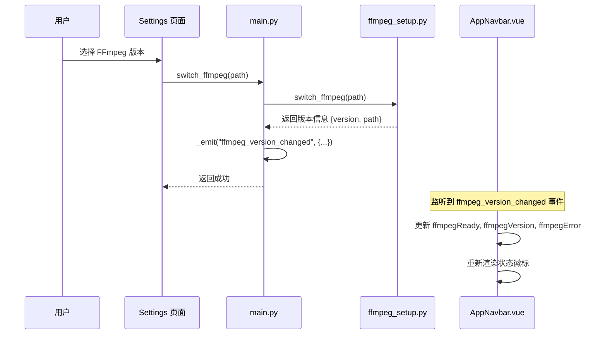
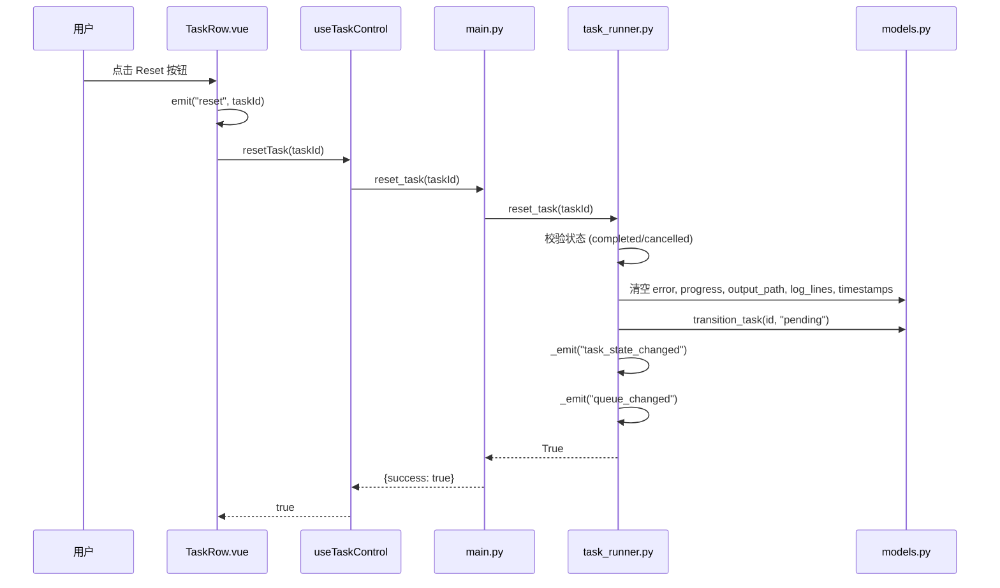
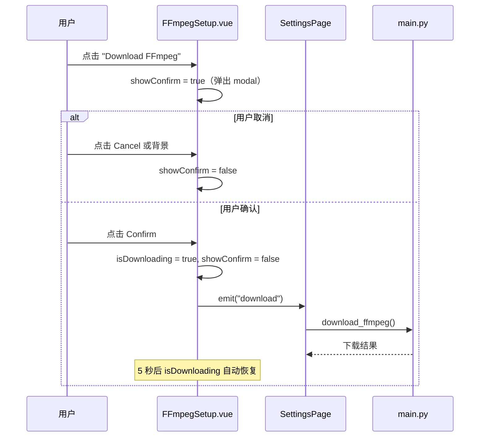
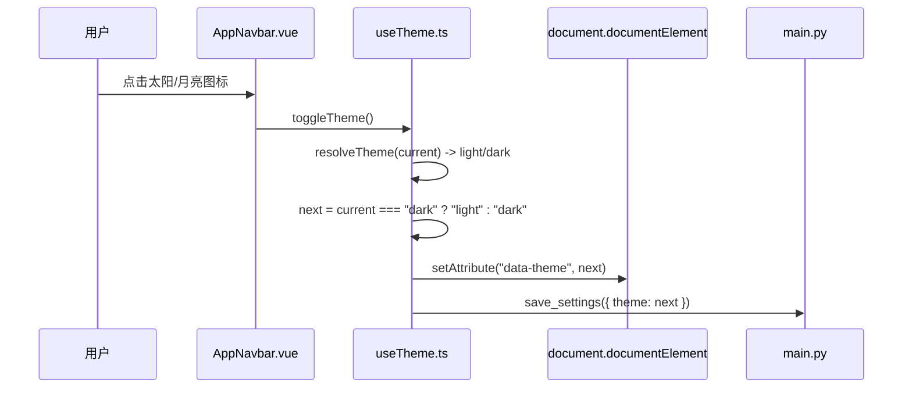

# 业务流程

## FFmpeg 版本切换流程

<!-- v2.1.0-CHANGE: 行3-行25 新增版本切换与实时更新流程 -->

### 流程说明

1. 用户在 Settings 页面的 FFmpeg 面板中选择一个版本
2. 前端调用 `switch_ffmpeg(path)` Bridge API
3. 后端执行 FFmpeg 版本切换，验证路径有效性
4. 后端通过 `_emit("ffmpeg_version_changed")` 广播事件
5. AppNavbar 监听事件并实时更新 FFmpeg 状态徽标

## 任务 Reset 流程

<!-- v2.1.0-CHANGE: 行30-行55 新增 Reset 流程 -->

### 流程说明

1. 用户在 completed/cancelled 任务的 Action 列点击 Reset 按钮
2. TaskRow 发射 `reset` 事件，TaskQueuePage 调用 `useTaskControl.resetTask(id)`
3. composable 调用后端 `reset_task(id)` Bridge API
4. `task_runner.reset_task` 执行：
   - 校验任务状态为 completed 或 cancelled
   - 清空所有运行时数据（error, progress, output_path, log_lines, started_at, completed_at）
   - 调用 `transition_task` 将状态转为 pending
   - 广播 `task_state_changed` 和 `queue_changed` 事件
5. 前端通过事件更新 UI，任务回到 pending 状态

## Download FFmpeg 流程

<!-- v2.1.0-CHANGE: 行60-行82 新增下载确认流程 -->

### 流程说明

1. Download FFmpeg 按钮始终可见（不受 FFmpeg 当前状态影响）
2. 点击后弹出 DaisyUI modal 确认对话框
3. 用户确认后：设置 loading 状态 -> 触发 download 事件 -> 父组件处理后端调用
4. 下载过程中按钮禁用并显示 spinner
5. detecting 状态时按钮也禁用

## 主题切换流程

<!-- v2.1.0-CHANGE: 行87-行105 新增主题切换流程 -->

### 流程说明

1. 用户点击导航栏的主题切换按钮
2. `toggleTheme()` 解析当前实际主题，切换到相反主题
3. 通过修改 `data-theme` 属性切换 DaisyUI 主题
4. 异步保存到后端 settings.json（失败不影响本地主题）
5. auto 模式下监听系统主题变化事件自动更新
